# Financial Sentiment Analysis - Architecture Documentation

This document provides comprehensive architecture diagrams and documentation for the Financial Sentiment Analysis project.

## Table of Contents
1. [System Architecture](#system-architecture)
2. [Data Flow Architecture](#data-flow-architecture)
3. [Component Interaction](#component-interaction)
4. [ML Pipeline Architecture](#ml-pipeline-architecture)
5. [Deployment Architecture](#deployment-architecture)

---

## System Architecture

The system follows a modular architecture with clear separation of concerns:

**Layer Descriptions:**
- **Presentation Layer**: User interface built with Streamlit for interactive analysis
- **Application Layer**: Business logic for predictions and visualizations
- **Core Processing Layer**: Data processing, model training, and analysis
- **Model Layer**: Pre-trained TinyBERT model and tokenization
- **Data Layer**: Storage for financial documents and news data

---

## Data Flow Architecture

This diagram shows how data flows through the system from input to output:

**Key Data Transformations:**
1. **Input Processing**: PDF extraction or direct text input
2. **Text Preprocessing**: Multi-step cleaning and normalization
3. **Tokenization**: Converting text to model-compatible format
4. **Model Inference**: TinyBERT processes tokenized input
5. **Post-processing**: Sentiment scoring, direction assignment, and explainability

---

## Component Interaction

This diagram illustrates how different components interact with each other:

```mermaid
sequenceDiagram
    actor User
    participant Dashboard as Streamlit Dashboard
    participant Predictor as Sentiment Predictor
    participant Core as Financial Analysis Core
    participant Model as TinyBERT Model
    participant SHAP as SHAP Explainer
    participant Viz as Attention Visualizer
    
    User->>Dashboard: Upload PDF/Enter Text
    Dashboard->>Dashboard: read_pdf() or get text
    Dashboard->>Predictor: analyze_text(input_text)
    
    Predictor->>Core: preprocess_text(input_text)
    Core->>Core: Clean, tokenize, lemmatize
    Core-->>Predictor: preprocessed_text
    
    Predictor->>Model: tokenizer(preprocessed_text)
    Model-->>Predictor: input_ids, attention_mask
    
    Predictor->>Model: model(**inputs, output_attentions=True)
    Model->>Model: Forward pass through layers
    Model-->>Predictor: logits, attention_weights
    
    Predictor->>Predictor: torch.softmax(logits)
    Predictor->>Predictor: argmax → predicted_class
    
    Predictor->>Core: assign_sentiment_scores(text)
    Core->>Core: VADER analysis
    Core-->>Predictor: sentiment_score
    
    Predictor->>Core: assign_directions(score)
    Core-->>Predictor: direction
    
    Predictor->>SHAP: explainer([preprocessed_text])
    SHAP->>SHAP: Calculate SHAP values
    SHAP-->>Predictor: shap_values
    
    Predictor->>Viz: visualize_attention(tokens, attention_weights)
    Viz->>Viz: Create heatmap
    Viz-->>Predictor: attention_plot
    
    Predictor-->>Dashboard: {sentiment, score, direction, shap_values, attention_plot}
    
    Dashboard->>Dashboard: Display metrics
    Dashboard->>Dashboard: Plot SHAP waterfall charts
    Dashboard->>Dashboard: Show attention heatmap
    Dashboard-->>User: Analysis Results
```

**Interaction Flow:**
1. User provides input through Streamlit dashboard
2. Dashboard delegates to Sentiment Predictor
3. Predictor coordinates preprocessing, model inference, and analysis
4. Multiple analysis components run in parallel (SHAP, attention, VADER)
5. Results are aggregated and returned to dashboard
6. Dashboard renders visualizations and metrics

---

## ML Pipeline Architecture

This diagram shows the complete machine learning pipeline from training to inference:

**Pipeline Stages:**
1. **Data Collection**: Gather financial documents and news articles
2. **Preprocessing**: Clean and normalize text data
3. **Feature Engineering**: Extract sentiment features and labels
4. **Data Augmentation**: Handle class imbalance with SMOTE and augmentation
5. **Model Training**: Fine-tune TinyBERT with optimized hyperparameters
6. **Evaluation**: Comprehensive metrics and validation
7. **Deployment**: Save and load model for production use
8. **Inference**: Real-time prediction on new inputs

---

## Deployment Architecture

This diagram shows the deployment architecture for the application:

**Deployment Components:**

### Client Layer
- **Web Browser**: Users access the application through any modern web browser

### Application Server
- **Streamlit Server**: Runs on localhost:8501 (default)
- **Dashboard Module**: Handles UI rendering and user interactions
- **Predictor Module**: Manages sentiment prediction logic
- **Visualization Module**: Generates attention and SHAP visualizations

### ML Components (In-Memory)
- **TinyBERT Model**: Loaded once at startup for fast inference
- **Tokenizer**: Pre-loaded for text tokenization
- **SHAP Explainer**: Initialized for model interpretability

### File System
- **Project Directory**: Contains all source code and data
- **Data Storage**: PDF files and CSV news data
- **Model Cache**: Hugging Face models cached locally
- **NLTK Data**: Downloaded corpora and models

### External Services
- **Hugging Face Hub**: Source for pre-trained models (first-time download)

### Python Environment
- **Virtual Environment**: Isolated Python environment
- **Dependencies**: All required packages installed via requirements.txt

---

## Technology Stack

### Core Technologies
- **Python 3.x**: Primary programming language
- **PyTorch**: Deep learning framework
- **Transformers**: Hugging Face library for NLP models
- **Streamlit**: Web application framework

### NLP Libraries
- **NLTK**: Natural language processing toolkit
- **nlpaug**: Data augmentation library

### ML & Analysis
- **SHAP**: Model interpretability
- **scikit-learn**: ML utilities and metrics
- **imbalanced-learn**: SMOTE for class balancing

### Visualization
- **Matplotlib**: Plotting library
- **Seaborn**: Statistical visualizations

### Data Processing
- **Pandas**: Data manipulation
- **NumPy**: Numerical computing
- **PyPDF2**: PDF text extraction

### Model
- **TinyBERT**: Lightweight BERT variant (huawei-noah/TinyBERT_General_4L_312D)
  - 4 layers, 312 hidden dimensions
  - Optimized for speed and efficiency
  - Fine-tuned for 3-class sentiment classification (Bullish, Neutral, Bearish)

---

## Performance Considerations

### Model Optimization
- **TinyBERT**: Chosen for balance between accuracy and inference speed
- **Batch Processing**: Efficient handling of multiple inputs
- **GPU Support**: Optional CUDA acceleration if available

### Caching Strategy
- **Model Caching**: Pre-trained models cached locally
- **Streamlit Caching**: UI components cached for faster rendering

### Scalability
- **Stateless Design**: Each prediction is independent
- **Modular Architecture**: Easy to scale individual components
- **Async Processing**: Potential for concurrent predictions

---

## Security Considerations

### Data Privacy
- **Local Processing**: All data processed locally, no external API calls
- **No Data Persistence**: User inputs not stored permanently

### Model Security
- **Verified Models**: Using official Hugging Face models
- **Dependency Management**: Regular updates via requirements.txt

---

## Future Enhancements

### Potential Improvements
1. **API Layer**: REST API for programmatic access
2. **Database Integration**: Store analysis history
3. **Real-time Data**: Integration with financial news APIs
4. **Multi-language Support**: Extend to non-English texts
5. **Model Ensemble**: Combine multiple models for better accuracy
6. **Cloud Deployment**: Deploy to cloud platforms (AWS, Azure, GCP)
7. **Batch Processing**: Analyze multiple documents simultaneously
8. **Custom Model Training**: Allow users to fine-tune on their data

---

## Conclusion

This architecture provides a robust, modular, and scalable foundation for financial sentiment analysis. The clear separation of concerns allows for easy maintenance and future enhancements while maintaining high performance and accuracy.
