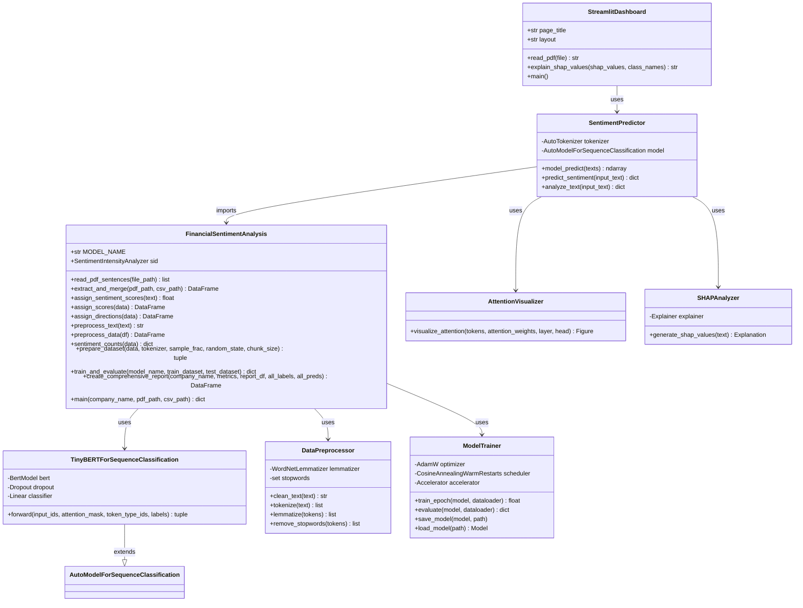
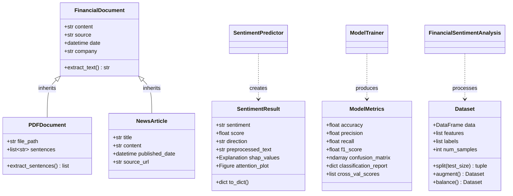
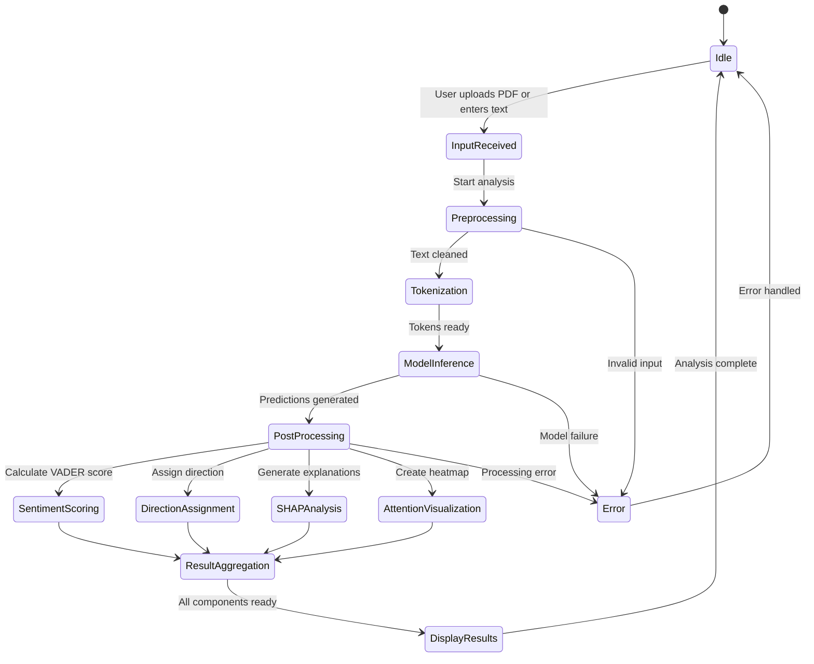
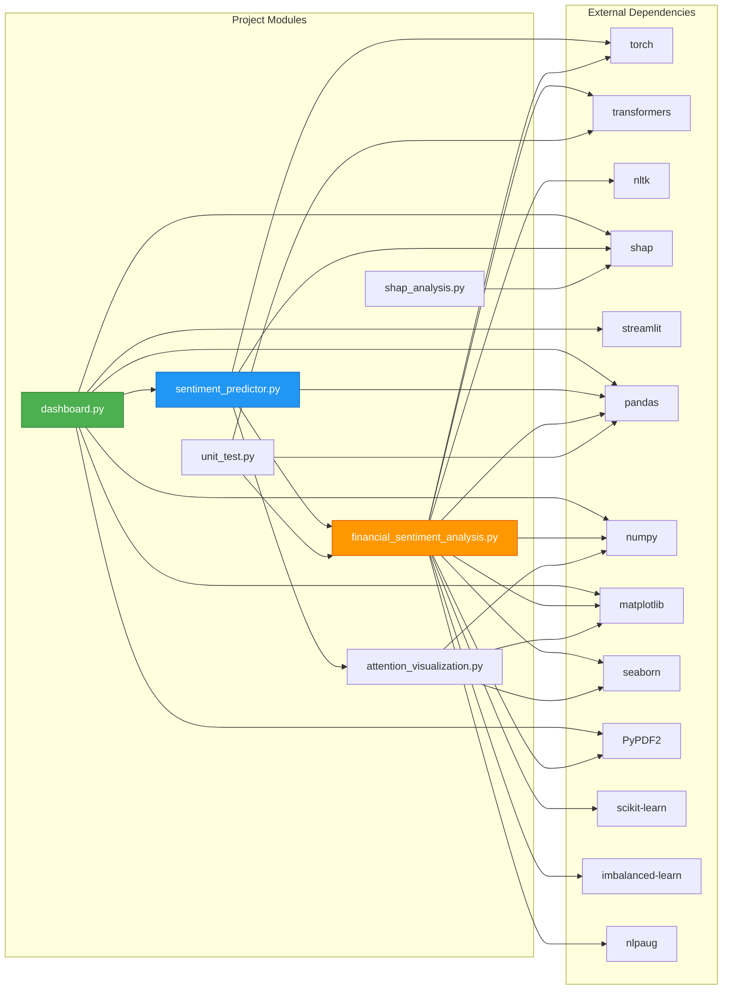
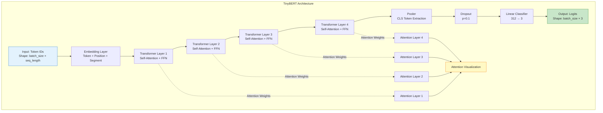
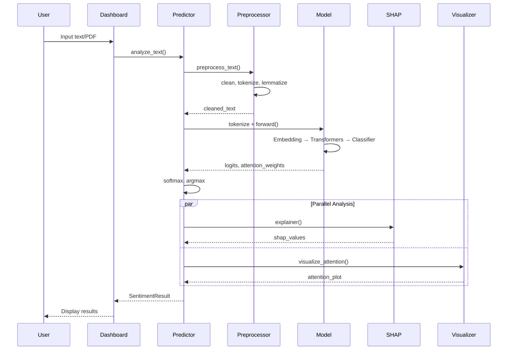

# Class Diagram - Financial Sentiment Analysis

This document provides detailed class diagrams showing the object-oriented structure of the project.

## Core Classes and Modules

## Data Models

## Workflow State Machine

## Component Dependencies

## Model Architecture

## Testing Architecture

```mermaid
graph TB
    subgraph "Unit Tests"
        A[test_read_pdf_sentences_valid]
        B[test_read_pdf_sentences_invalid_path]
        C[test_extract_and_merge_valid]
        D[test_extract_and_merge_missing_files]
        E[test_assign_sentiment_scores_positive]
        F[test_assign_sentiment_scores_negative]
        G[test_assign_sentiment_scores_neutral]
        H[test_assign_directions_bearish]
        I[test_assign_directions_bullish]
        J[test_assign_directions_neutral]
        K[test_preprocess_text_lowercase]
        L[test_preprocess_text_remove_numbers]
        M[test_preprocess_data_valid]
        N[test_prepare_dataset_valid]
    end
    
    subgraph "Test Targets"
        O[read_pdf_sentences]
        P[extract_and_merge]
        Q[assign_sentiment_scores]
        R[assign_directions]
        S[preprocess_text]
        T[preprocess_data]
        U[prepare_dataset]
    end
    
    subgraph "Test Data"
        V[sample_data/pdf_2.pdf]
        W[sample_data/pdf_3.pdf]
        X[sample_data/iag_sample_csv.csv]
    end
    
    A --> O
    B --> O
    C --> P
    D --> P
    E --> Q
    F --> Q
    G --> Q
    H --> R
    I --> R
    J --> R
    K --> S
    L --> S
    M --> T
    N --> U
    
    O --> V
    O --> W
    P --> V
    P --> W
    P --> X
    
    style A fill:#C8E6C9,stroke:#388E3C
    style B fill:#C8E6C9,stroke:#388E3C
    style C fill:#C8E6C9,stroke:#388E3C
    style D fill:#C8E6C9,stroke:#388E3C
    style E fill:#C8E6C9,stroke:#388E3C
    style F fill:#C8E6C9,stroke:#388E3C
    style G fill:#C8E6C9,stroke:#388E3C
    style H fill:#C8E6C9,stroke:#388E3C
    style I fill:#C8E6C9,stroke:#388E3C
    style J fill:#C8E6C9,stroke:#388E3C
    style K fill:#C8E6C9,stroke:#388E3C
    style L fill:#C8E6C9,stroke:#388E3C
    style M fill:#C8E6C9,stroke:#388E3C
    style N fill:#C8E6C9,stroke:#388E3C
```

---

## Key Design Patterns

### 1. **Facade Pattern**
- `SentimentPredictor` acts as a facade, providing a simplified interface to the complex subsystem of preprocessing, model inference, and analysis.

### 2. **Strategy Pattern**
- Different preprocessing strategies can be applied (lemmatization, stemming, etc.)
- Multiple model architectures can be swapped (TinyBERT, AdaBoost, SVM, etc.)

### 3. **Pipeline Pattern**
- Data flows through a series of transformations: Input → Preprocessing → Tokenization → Model → Post-processing → Output

### 4. **Singleton Pattern**
- Model and tokenizer are loaded once and reused across predictions to save memory and time

### 5. **Observer Pattern**
- Streamlit's reactive framework observes user inputs and triggers re-computation when needed

---

## Module Responsibilities

### `dashboard.py`
- **Responsibility**: User interface and interaction
- **Key Functions**: File upload, text input, result display, visualization rendering
- **Dependencies**: Streamlit, SentimentPredictor

### `sentiment_predictor.py`
- **Responsibility**: Orchestrate prediction workflow
- **Key Functions**: Text analysis, model prediction, SHAP generation, attention visualization
- **Dependencies**: FinancialSentimentAnalysis, AttentionVisualizer, TinyBERT

### `financial_sentiment_analysis.py`
- **Responsibility**: Core ML pipeline and data processing
- **Key Functions**: Data extraction, preprocessing, model training, evaluation
- **Dependencies**: PyTorch, Transformers, NLTK, scikit-learn

### `attention_visualization.py`
- **Responsibility**: Visualize model attention weights
- **Key Functions**: Generate heatmaps showing token importance
- **Dependencies**: Matplotlib, Seaborn

### `shap_analysis.py`
- **Responsibility**: Model interpretability
- **Key Functions**: Generate SHAP values for predictions
- **Dependencies**: SHAP library

### `unit_test.py`
- **Responsibility**: Automated testing
- **Key Functions**: Validate core functionality
- **Dependencies**: pytest, FinancialSentimentAnalysis

---

## Data Flow Between Classes

---

## Conclusion

This class diagram documentation provides a comprehensive view of the object-oriented structure, dependencies, and design patterns used in the Financial Sentiment Analysis project. The modular design ensures maintainability, testability, and extensibility.
